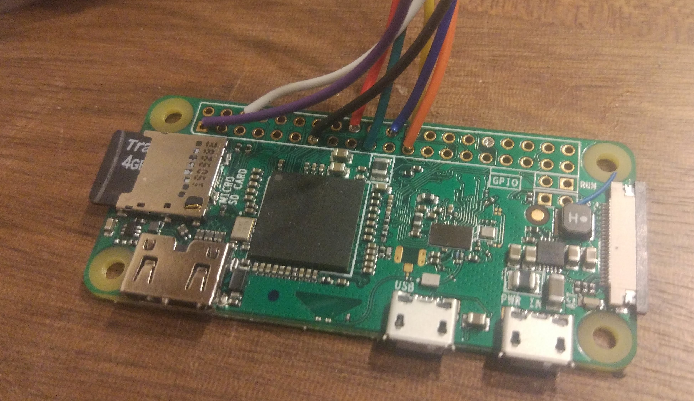

# To install

1. `sudo apt-get install python3-numpy` so screen drawing doesn't totally suck (about 13x speed increase!)
2. `pip3 install -r requirements.txt`
3. clone this repo into your home directory /home/pi/
4. to start the display at startup of pi, add `sudo -u pi /usr/bin/python3 /home/pi/sonos-lcd/main.py &` to /etc/rc.local

# Running

Start with `./main.py`

If you want to debug on OSX (with the mini-screen displayed on your laptop screen) install tkinter.

# Needed Hardware

- raspberry zero W (unpopulated, that is without pin header), e.g. from [adafruit](https://www.adafruit.com/product/3400) for $10
- rii i8 mini keyboard, e.g. [from amazon](https://www.amazon.com/dp/B01GCPVZDW) for $25
- waveshared 1.8 inch LCD module, e.g. [from amazon](https://www.amazon.com/dp/B0785SRXDG) for $13.20
- micro usb b to usb a adapter, e.g. [from adafruit](https://www.adafruit.com/product/2910) for $3
- micro sd card, optimized for read/writes for fast startup. [This article ecommends Samsung Evo+](https://www.jeffgeerling.com/blog/2019/raspberry-pi-microsd-card-performance-comparison-2019), e.g. [from Amazon](https://www.amazon.com/dp/B0749KG1JK) for $7.50

Total costs: $58.70

# Soldering

